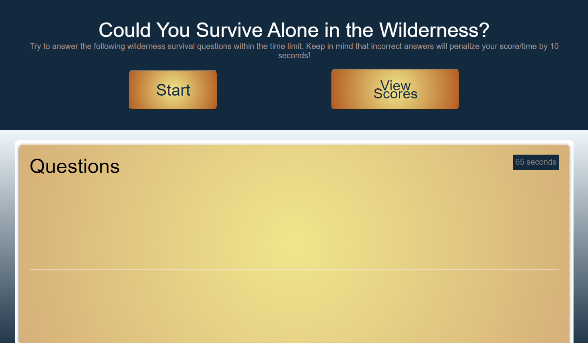
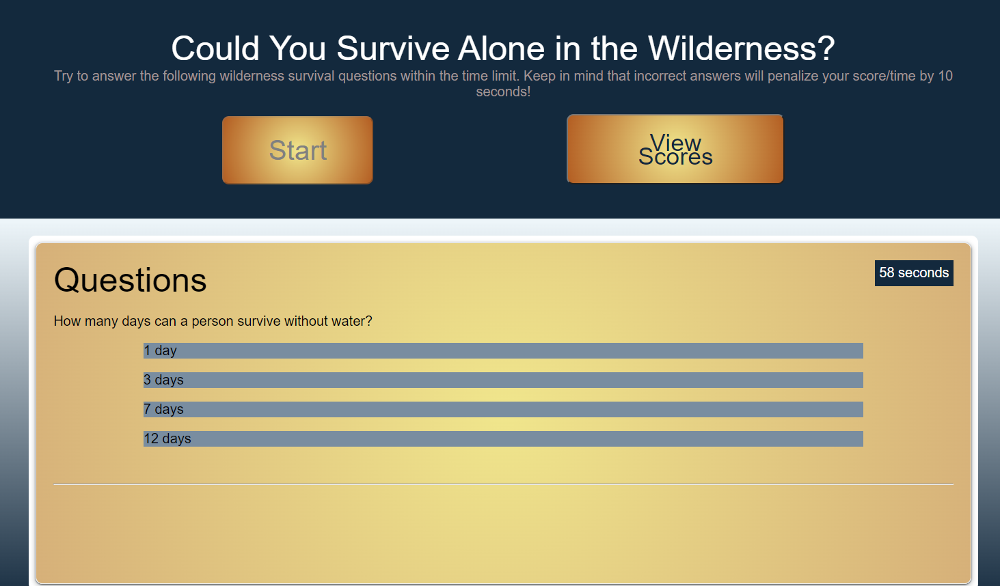
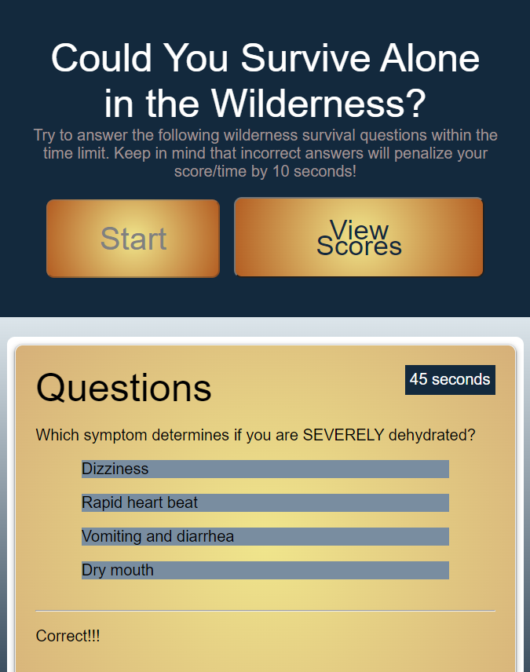
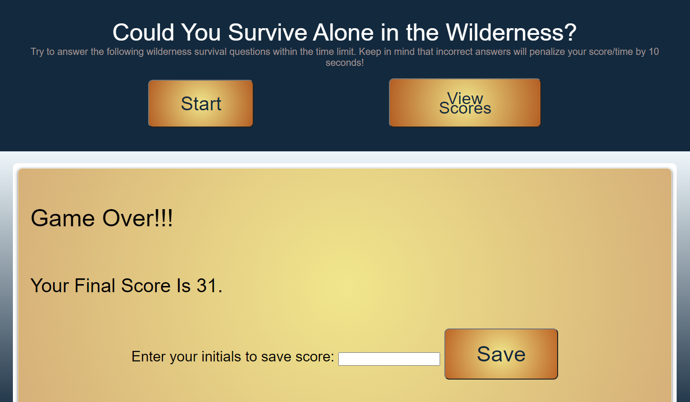
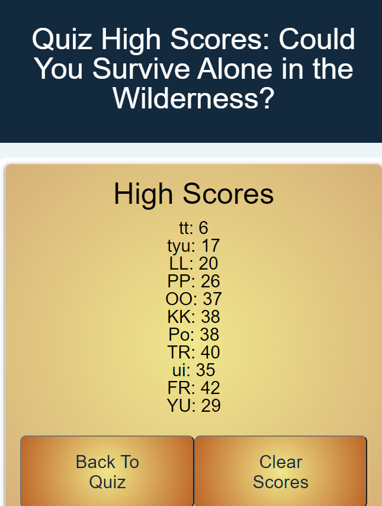

# Survival-Quiz
Quiz to see how well you know how to survive in the wilderness

Goals of this application:

* create a timed multiple choice quiz where the user will get extra points taken off if they choose an incorrect answer

* when the game is over, the user gets the opportunity to save their score into local storage and see what scores others who previously played the game got.

* the user can clear the stored scores

## Author
- [@LindaWaterhouse](https://www.github.com/llwaterhouse)

## Description

* On the home page, the user can choose to either start a new game or view the saved scores depending on what button they push

* Upon clicking Start, the first question appears with different answer options. 

* When the user clicks an option, there is feedback at the bottom indicating whether the answer chosen was correct or incorrect.

* The next question is then displayed.  If the answer was wrong, extra time is subtracted from the timer.

* When either the timer runs out or the user answers all of the questions, the game is over.

* The user can then enter their initials and save their score to local storage.

* When they save their score, a new page is displayed which reads all of the saved scores from local storage.

* The user can then select a button to either Clear all of the saved scores or go back and take the quiz again.

* A countdown area displays the current seconds remaining.

* The UI is responsive and works at many different screen sizes

* a favicon was created and added so that the user can identify the quiz's tab.

## Built With

* HTML
* CSS
* Javascript

## Prerequisites

If you want to edit this web page you must have a Github account, and have also downloaded Visual Studio Code.

[Create a Github account](https://github.com)

[Download Visual Studio](https://code.visualstudio.com/download/)

## Deliverables

### Screenshots

Initial screenshot

Display of first question

Example of the middle of the quiz with feedback

Game over screen that is shown at end of game with different screen width

Saved Scored page

### Repository

[GitHub repository for this project](https://github.com/llwaterhouse/Survival-Quiz)

### Deployed Application

[The deployed GitPage Application](https://llwaterhouse.github.io/Survival-Quiz/)

## Acknowledgements

Rutgers Coding Bootcamp

---

© 2021 Linda Waterhouse Consulting. Confidential and Proprietary. All Rights Reserved.

Permission is hereby granted, free of charge, to any person obtaining a copy of this software and associated documentation files (the "Software"), to deal in the Software without restriction, including without limitation the rights to use, copy, modify, merge, publish, distribute, sublicense, and/or sell copies of the Software, and to permit persons to whom the Software is furnished to do so, subject to the following conditions:

The above copyright notice and this permission notice shall be included in all copies or substantial portions of the Software.

THE SOFTWARE IS PROVIDED "AS IS", WITHOUT WARRANTY OF ANY KIND, EXPRESS OR IMPLIED, INCLUDING BUT NOT LIMITED TO THE WARRANTIES OF MERCHANTABILITY, FITNESS FOR A PARTICULAR PURPOSE AND NONINFRINGEMENT. IN NO EVENT SHALL THE AUTHORS OR COPYRIGHT HOLDERS BE LIABLE FOR ANY CLAIM, DAMAGES OR OTHER LIABILITY, WHETHER IN AN ACTION OF CONTRACT, TORT OR OTHERWISE, ARISING FROM, OUT OF OR IN CONNECTION WITH THE SOFTWARE OR THE USE OR OTHER DEALINGS IN THE SOFTWARE.

